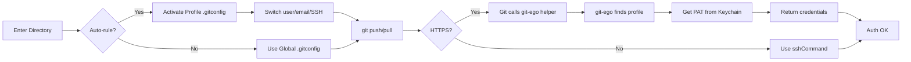

<p align="center">
  
</p>

[](https://github.com/bgreenwell/git-ego/actions/workflows/go-ci.yml)
[](https://pkg.go.dev/github.com/bgreenwell/git-ego)
[](https://github.com/bgreenwell/git-ego/releases/latest)

[](https://opensource.org/licenses/MIT)
[](https://go.dev/)
[](#installation)
[](https://github.com/bgreenwell/git-ego/releases/latest)

> Git identity manager with directory-based profile switching.

`git-ego` manages separate Git identities for work, personal projects, and clients. Profiles can set `user.name`, `user.email`, SSH keys, signing keys, and HTTPS credentials.

---

## Key features

- Directory-based profile switching using Git `includeIf`.
- Per-profile commit identity, SSH configuration, signing keys, and HTTPS host scopes.
- PATs stored in the operating-system keychain and served through Git's credential-helper protocol.
- Optional pre-commit identity check.

## Installation

### Package managers

**macOS / Linux (Homebrew):**

```bash
brew install bgreenwell/tap/git-ego
```

**Windows (Scoop):**

```powershell
scoop bucket add bgreenwell https://github.com/bgreenwell/scoop-bucket
scoop install git-ego
```

**Windows (WinGet):** _(Coming soon — pending initial PR merge)_

```powershell
winget install --id bgreenwell.GitEgo
```

### Go

Or install from source with [Go](https://go.dev/dl/) 1.24 or newer:

```bash
go install github.com/bgreenwell/git-ego@latest
```

Ensure your Go bin directory (typically `~/go/bin`) is in `PATH` when using
`go install`.

### GitHub account-switch smoke test

For a test profile and repository you control, run the included account-switch
smoke test. It reads the test-account PAT from `GH_GIT_EGO`, verifies keychain
retrieval and host scoping, writes a timestamped entry to a smoke-test
changelog, pushes through the test profile, and restores your regular profile.

```bash
GIT_EGO_SMOKE_RETURN_PROFILE=personal \
  scripts/gh-account-switch-smoke-test.sh --push
```

## One-time setup: Configure Git

Configure Git to use `git-ego` as its credential helper for supported HTTPS hosts.

```bash
# Clear any old, conflicting helpers
git config --global credential.helper ""

# Set git-ego as the one and only helper, using the required '\!' prefix
git config --global --add credential.helper "!git-ego credential"
```

## Example usage

Here’s a typical workflow for setting up and using `git-ego`.

#### 1\. Add your profiles

First, define your different identities.

```bash
# A simple personal profile
git-ego add personal --name "Brandon" --email "brandon.personal@email.com" --username "bgreenwell-personal"

# A work profile that uses a specific SSH key
git-ego add work-ssh --name "Brandon Greenwell" --email "brandon.work@company.com" --username "bgreenwell-work" --ssh-key ~/.ssh/id_work

# A client profile that uses a PAT for HTTPS. Store the token separately so
# it never enters shell history or the process list.
git-ego add client-abc --name "Brandon G." --email "brandon@client-abc.com" --username "bgreenwell-client"
printf '%s' "$CLIENT_GITHUB_TOKEN" | git-ego pat set client-abc

# A non-GitHub profile must explicitly name its HTTPS host.
git-ego add gitlab-work --name "Brandon" --email "brandon@company.com" --username "bgreenwell" --host gitlab.company.com
```

#### 2\. List your configured profiles

Use the `list` (or `ls`) command to see all the profiles you’ve saved.

```bash
git-ego list
```

```
ACTIVE  PROFILE     NAME                 EMAIL                       ATTRIBUTES
------  -------     ----                 -----                       ----------
        client-abc  Brandon G.           brandon@client-abc.com      [PAT]
        personal    Brandon              brandon.personal@email.com
        work-ssh    Brandon Greenwell    brandon.work@company.com    [SSH]
```

#### 3\. Set a global default

The `use` command sets your default global identity for any repositories that don’t have a specific rule. This will also update your global `.gitconfig`.

```bash
git-ego use personal
```

```
✓ Set active profile to 'personal'.
```

`git-ego list` marks the active profile with an asterisk:

```
ACTIVE  PROFILE     NAME                 EMAIL                       ATTRIBUTES
------  -------     ----                 -----                       ----------
        client-abc  Brandon G.           brandon@client-abc.com      [PAT]
*       personal    Brandon              brandon.personal@email.com
        work-ssh    Brandon Greenwell    brandon.work@company.com    [SSH]
```

#### 4\. Configure automatic switching

Now, tell `git-ego` which profiles to use for which project directories.

```bash
git-ego auto ~/dev/work/ work-ssh
git-ego auto ~/dev/personal/ personal

# Review or remove one rule later.
git-ego auto list
git-ego auto rm ~/dev/personal/
```

When you `cd` into `~/dev/work/any-repo`, your `user.name`, `user.email`, and `sshCommand` will be automatically switched to the `work-ssh` profile.

For a repository-specific safety expectation, create an untracked `.gitego` file containing one profile name (for example `work-ssh`). `status`, the credential helper, and the commit safety check will use it in preference to directory rules. Add `.gitego` to the repository's local `.gitignore` if it should not be shared.

-----

## Commands

| Command | Alias | Description |
|---|---|---|
| `git-ego add <name>` | | Adds a new user profile. |
| `git-ego rm <name>` | `remove` | Removes a saved user profile, asking for confirmation. |
| `git-ego list` | `ls` | Lists all saved user profiles and their attributes. |
| `git-ego list --check-pats` | | Opt in to keyring checks and PAT markers. |
| `git-ego use <name>` | | Sets a profile as the active global default. |
| `git-ego auto <path> <name>` | | Sets a profile to be used automatically for a given directory path. |
| `git-ego status` | | Displays the current effective Git user and the source of the configuration. |
| `git-ego edit <name>` | | Edits an existing user profile's attributes. |
| `git-ego pat set <name>` | | Stores a PAT read from standard input. |
| `git-ego install-hook` | | Installs a pre-commit hook in the current repo to prevent misattributed commits. |
| `git-ego completion <shell>`| | Generates shell completion scripts. |
| `git-ego doctor` | | Checks auto-switch rules for Git/YAML drift. |
| `git-ego doctor --repair` | | Repairs missing generated includes and auto-rules. |
| `git-ego use <name> --local` | | Applies an identity only in the current repository. |
| `git-ego profiles export/import <file>` | | Exports or imports profile configuration without PATs. |
| `git-ego --version` | `-v` | Prints the application version. |

## How it works

`git-ego` uses Git conditional includes and the credential-helper protocol.

### Visualizing the workflow



### 1\. Identity switching: `includeIf`

For managing your commit identity (`user.name`, `user.email`) and SSH keys, `git-ego` uses a Git feature called conditional includes.

When you run `git-ego auto ~/work work-ssh`:

1.  `git-ego` creates a small, dedicated config file at `~/.gitego/profiles/work-ssh.gitconfig`.
2.  This file contains only the `[user]` and `[core]` information for that profile.
3.  `git-ego` then adds a block to your main `~/.gitconfig` file that looks like this:
    ```ini
    [includeIf "gitdir:~/work/"]
        path = ~/.gitego/profiles/work-ssh.gitconfig
    ```

This tells Git to merge the profile settings for repositories inside `~/work/`.

### 2\. Authentication: credential helper

For handling Personal Access Tokens (PATs) with HTTPS remotes, `git-ego` acts as a **Git credential helper**.

1.  **Configuration**: The `git config --global credential.helper '!git-ego credential'` command tells Git that whenever it needs a username or password for an `https://` URL, it should run the `git-ego credential` command.
2.  **Execution**: When you run `git push` or `git pull` on an HTTPS remote, Git executes `git-ego credential` in the background and pipes it the protocol, host, and path information.
3.  **Context Resolution**: The `git-ego credential` command uses the same logic as `git-ego status`: it checks the current working directory to find the active profile via auto-rules or the global default.
4.  **Secure Retrieval**: It then fetches the corresponding PAT for that profile from your operating system's native, secure keychain (macOS Keychain, Windows Credential Manager, or Linux Secret Service).
5.  **Response**: Finally, it prints the username and PAT to standard output, which Git reads to complete the authentication.

### Security model

PAT handling:

  * **No Plaintext PATs:** Personal Access Tokens (PATs) are never stored in plaintext in the configuration file.
  * **Secure OS Keychain:** `git-ego` uses the native, secure keychain of your operating system to store and retrieve your PATs. This is the same secure storage that tools like Docker and other credential managers use.
  * **Host Scoping:** The credential helper only provides a token for an HTTPS host explicitly configured on the selected profile. It ignores requests for other hosts and all `store` and `erase` operations.
  * **In-Memory Use:** The token is passed directly to Git in memory and is not logged or stored elsewhere.


## Contributing

Contributions are welcome\! Please feel free to open an issue or submit a pull request.

## License

This project is licensed under the MIT License.
